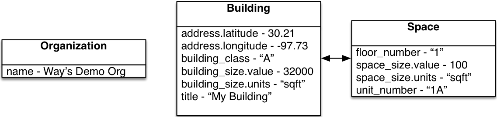

RealMassive REST API Programming Guide
--

Revision: Draft-1

This guide will show you how to programmatically create and manage inventory on RealMassive using our REST API. Topics covered include: (1) creating and relating entities; (2) permissions; (3) entity relationships; (4) and finally, examples.

Before reading this guide, please review the resources in our [Quickstart Guide](https://realmassive.github.io/realmassive.github.io/index.html). This guide assumes you have read and understand all content therein, including JSON API and authorization (tokens).


# Creating and Relating Entities

The core patttern for managing data on RealMassive through our REST API has two steps: _Create_ & _Relate_.

## 1. Create one or more Entities

Entities are objects like `Buildings`, `Spaces`, `Leases`, `Subleases`, `Contacts`, `Organizations`, etc. These represent real world concepts from commercial real estate. 
* You create entities by sending a `POST` request with an appropriate JSON payload.
* Responses to your successful requests will contain a new identifier (`id`) for the newly created entity. Store that id somewhere, you will need it for later steps.
* Each entity's full structure can be found in our API documentation here (https://app.swaggerhub.com/apis/inchoate/real-massive_api/2.0). Fields not editable by the user are: `created`, `id`, and `updated`. Those can be safely ignored when creating entities.

### Example 1. Create an Organization
#### Request
```shell
curl -X POST \
  https://api-sandbox.realmassive.com/organizations \
  -H 'authorization: Bearer eyJhbG..byAw5QC4JM' \
  -H 'content-type: application/json' \
  -d '{
  "data": {
    "attributes": {
      "address": {
        "city": "Austin",
        "county": "Travis",
        "full_state": "Texas",
        "state": "TX",
        "street": "1145 W 5th",
        "zipcode": "78703"
      },
      "bio": "RealMassive is an Austin-based tech startup disrupting a $15 trillion industry by connecting every person and place in a modern, global commercial real estate (CRE) marketplace. We leverage big data to provide CRE pros with intuitive property list and search tools, digital marketing capabilities, and real-time performance analytics. Our digital marketplace is the nexus between tenants, investors, owners, properties, and brokers. We'\''re in fast-growth mode and seeking the most talented and ambitious candidates to help us scale our business quickly.",
      "email": "contact@realmassive.com",
      "name": "RealMassive",
      "phone": "(682) 587-9750",
      "social": {
        "linkedin": "https://www.linkedin.com/company/realmassive",
        "twitter": "https://www.twitter.com/realmassive",
        "website": "https://www.realmassive.com"
      }
    },
    "type": "organizations"
  }
}
'
```

#### Response
```python
{
  "data": {
    "attributes": {
      "bio": "RealMassive is an Austin-based tech startup disrupting a $15 trillion industry by connecting every person and place in a modern, global commercial real estate (CRE) marketplace. We leverage big data to provide CRE pros with intuitive property list and search tools, digital marketing capabilities, and real-time performance analytics. Our digital marketplace is the nexus between tenants, investors, owners, properties, and brokers. We're in fast-growth mode and seeking the most talented and ambitious candidates to help us scale our business quickly.",
      "updated": "2017-05-26T22:00:25.890105+00:00",
      "name": "RealMassive",
      "created": "2017-05-26T22:00:25.890105+00:00",
      "social": {
        "website": "https://www.realmassive.com",
        "twitter": "https://www.twitter.com/realmassive",
        "linkedin": "https://www.linkedin.com/company/realmassive"
      },
      "phone": "(682) 587-9750",
      "address": {
        "city": "Austin",
        "zipcode": "78703",
        "county": "Travis",
        "state": "TX",
        "street": "1145 W 5th",
        "full_state": "Texas"
      },
      "email": "contact@realmassive.com"
    },
    "type": "organizations",
    "id": "1523505465516885282"
  }
}
```

### Example 2. Create a Building
#### Request

```shell
curl -X POST \
  https://api-staging.realmassive.com/buildings \
  -H 'authorization: Bearer eyJhbG..byAw5QC4JM' \
  -H 'content-type: application/json' \
  -d '{
  "data": {
    "attributes": {
      "address": {
        "city": "Austin",
        "county": "Travis",
        "full_state": "Texas",
        "latitude": 30.2714351,
        "longitude": -97.7602741,
        "state": "TX",
        "street": "1145 W 5th St",
        "zipcode": "78703"
      },
      "air_conditioned": true,
      "build_status": "existing",
      "building_class": "C",
      "building_size": {
        "units": "SQFT",
        "value": 15000
      },
      "building_type": "office",
      "description": "string",
      "floor_count": 3,
      "signage": "Lighted sign on building.",
      "tenancy": "multi",
      "title": "RealMassive Office",
      "year_built": 1970
    },
    "type": "buildings"
  }
}'
```

#### Response

```shell
{
  "data": {
    "attributes": {
      "build_status": "existing",
      "updated": "2017-05-26T22:06:49.349060+00:00",
      "year_built": 1970,
      "floor_count": 3,
      "title": "RealMassive Office",
      "building_size": {
        "units": "SQFT",
        "value": "15000.000000"
      },
      "building_class": "C",
      "created": "2017-05-26T22:06:49.349060+00:00",
      "building_type": "office",
      "tenancy": "multi",
      "signage": "Lighted sign on building.",
      "address": {
        "city": "Austin",
        "zipcode": "78703",
        "longitude": -97.7602741,
        "county": "Travis",
        "state": "TX",
        "street": "1145 W 5th St",
        "latitude": 30.2714351,
        "full_state": "Texas"
      },
      "air_conditioned": true,
      "description": "string"
    },
    "type": "buildings",
    "id": "1523508682204120356"
  }
}
```

IDs that look like, `1523508682204120356` are globally unique in a RealMassive environment (like sandbox or production). Once you create your entities, you should save its type and id for later use.

If you're wondering how I knew what fields to send see our [API documentation](https://swaggerhub.com/apis/inchoate/real-massive_api/2.0), which enumerates the details.

In this step you created data using the API, but it's _free floating data_, not tied to any organization and won't be found in searches or listings. In the next step you will learn how to connect entities together creating usable data on our platform.

## 2. Relate the Entities

Assume you created a `Building` and `Space` using what you learned above. You now have a `Building` and a `Space`, but they don't know about each other. To relate them togther or (add the space to the building) you issue one more post commands:
  `POST /buildings/{building_id}/spaces`
passing to that route the payload with the space id. This relates the space to the specified building.

Let's consider another example, where we want to create a `Contact` for a `Lease.` You would do the following:
1. `POST /contacts` to create the new contact. Store the ID returned. The contact is stored in the databse:


2. `POST /leases` to create the new lease. Store the ID returned. The lease is added to the database, but is still unrelated to the contact:


3. `POST /leases/{leaseID}/contacts` to add that contact to that space. The lease and contact are now related; the "Lease has a contact":


Now that you understand the basic pattern, the next thing to know is how permissions and data are handled. 

# Data Hierarchy and Permissions

## Nomenclature and Types

It's important to clarify the different types of entities on the RealMassive platform. This is not a comprehensive list but should be enough information to give you a sense of how to work with the API.

- **Permissions-handling entities** - these entity types are used to manage access
on the RealMassive platform.
    - **Users** - Users represent a RealMassive user; this is what you use to log in.
    - **Teams** - Teams are used to give permissions to various users. Users are part of one or more teams.
    - **Permissions** - Permissions are actual objects that are related to a team and some other entity and have a permission level of read, write, or admin. Any user that belongs to a team uses the permissions objects related to that team to determine what the user has access to.
    - **Memberships** - Memberships are used to tie users to various teams. You won't have to worry about this one too much unless you are managing a users' teams.
- **Data entities** - these entity types represent actual data on the RealMassive
platform, and are what you will be interacting with
    - **Organizations** - Organizations are the *real world data representation* of any organization such as a company or firm in real life. Organizations entities can be associated with RealMassive users and teams, but there can also exist Organization entities that are represented as real world companies that are not on the RealMassive platform.
    - **Buildings** - Building entities represent real world buildings and can be related to Spaces.
    - **Spaces** - Space entities represent physical spaces in buildings that may be listed as for lease or sublease. For instance, a real-world building containing 30 office spaces will be represented as a Building entity with 30 Space entities related to it.
    - **Leases and Subleases** - Collectively referred to as "listings", Lease and Sublease entities represent the details of a space within a building being listed, such as rate, price, and availability date. Leases and Subleases are separate from Spaces because one Space could multiple Leases or Subleases available over different time periods (or perhaps concurrently!).

### Detailed Example: Creating your first listing

We'll show some demo requests and briefly explain what is happening. See the [RealMassive API documentation](http://docs.realmassiveapiv20.apiary.io/) for details on how to interact with each endpoint. NOTE: the API documentation is fairly verbose and descriptive, exhaustively detailing every endpoint, but almost every entity endpoint (save for Users, Teams, and Permissions) functions the same, following most parts of the [JSON API specification](http://jsonapi.org/).

The steps are roughly as follows:

1. [Create your organization](#Create-your-organization)
2. [Create a building](#Create-a-building)
3. [Create a space](#Create-a-space)
4. [Relate the space to the building](#Relate-the-space-to-the-building)
5. [Create a listing](#Create-a-listing) (and relate it to space and organization at the same time!)
6. [View the fruits of your labor](#View-the-fruits-of-your-labor)

#### Create your Organization

We want to create our own Organization so that we can assign listings to it. To do this, we send an HTTP POST request to the `/organizations` endpoint containing a JSON payload:

```
POST /organizations HTTP/1.1
Host: api.realmassive.com
Authorization: Bearer <Token>
Content-Type: application/json
Cache-Control: no-cache

{
    "data": {
        "type": "organizations",
        "attributes": {
            "name": "Way's Demo Org"
        }
    }
}
```

POST requests must be accompanied with two headers: `Authorization: Bearer <your_auth_token>` and `Content-Type: application/json`. The body should be raw JSON.

Here's what the whole thing looks like as a CURL request:

```
curl -X POST -H "Authorization: Bearer <Token>" -H "Content-Type: application/json" -H "Cache-Control: no-cache" -d '{
    "data": {
        "type": "organizations",
        "attributes": {
            "name": "Way'"'"'s Demo Org"
        }
    }
}' "https://api.realmassive.com/organizations"
```

After a successful creation, we receive the following response:

```
{
  "data": {
    "attributes": {
      "created": "2016-12-01T18:40:33.524153+00:00",
      "name": "Way's Demo Org",
      "updated": "2016-12-01T18:40:33.524153+00:00"
    },
    "id": "1395872364452906568",
    "type": "organizations"
  }
}
```

Hold onto the ID for later use.

Current State of the Database:


#### Create a building

Similar to creating an organization, we POST to `/buildings` with a JSON payload.

```
POST /buildings HTTP/1.1
Host: api-sandbox.realmassive.com
Authorization: Bearer <Token>
Content-Type: application/json
Cache-Control: no-cache

{
    "data": {
        "type": "buildings",
        "attributes": {
            "address": {
                "latitude": 30.21204,
                "longitude": -97.73125
            },
            "title": "My Building",
            "building_class": "A",
            "building_size": {
                "value": 32000,
                "units": "sqft"
            }
        }
    }
}
```

As a cURL request:

```
curl -X POST -H "Authorization: Bearer <Token>" -H "Content-Type: application/json" -H "Cache-Control: no-cache" -d '{
    "data": {
        "type": "buildings",
        "attributes": {
            "address": {
                "latitude": 30.21204,
                "longitude": -97.73125
            },
            "title": "My Building",
            "building_class": "A",
            "building_size": {
                "value": 32000,
                "units": "sqft"
            }
        }
    }
}' "https://api-sandbox.realmassive.com/buildings"
```

We receive a response indicating that our request worked:

```
{
  "data": {
    "attributes": {
      "address": {
        "latitude": 30.21204,
        "longitude": -97.73125
      },
      "building_class": "A",
      "building_size": {
        "units": "sqft",
        "value": "32000.000000"
      },
      "created": "2016-12-01T20:11:08.782713+00:00",
      "title": "My Building",
      "updated": "2016-12-01T20:11:08.782713+00:00"
    },
    "id": "1395889931850614350",
    "type": "buildings"
  }
}
```

In order for buildings to show up on RealMassive's search engine, it must have a latitude and longitude. At this time, address fields inputted will not automatically be geocoded.

[**You can see the total list of attributes for various schemas in this gist.**](https://gist.github.com/wayspurrchen/a272683dbb75f534dab4115f5616426f)

Current State of the Database:


#### Creating a Space

Once that's complete, you can create a Space that will be related to the building (we will do the relating in a different step).

We POST to `/spaces` with a payload:

```
POST /spaces HTTP/1.1
Host: api-sandbox.realmassive.com
Authorization: Bearer <Token>
Content-Type: application/json
Cache-Control: no-cache

{
    "data": {
        "type": "spaces",
        "attributes": {
            "floor_number": "1",
            "unit_number": "1A",
            "space_size": {
                "value": 1000,
                "units": "sqft"
            }
        }
    }
}
```

As a CURL:

```
curl -X POST -H "Authorization: Bearer <Token>" -H "Content-Type: application/json" -H "Cache-Control: no-cache" -d '{
    "data": {
        "type": "spaces",
        "attributes": {
            "floor_number": "1",
            "unit_number": "1A",
            "space_size": {
                "value": 1000,
                "units": "sqft"
            }
        }
    }
}' "https://api-sandbox.realmassive.com/spaces"
```

You'll notice that all of these requests are practically identical in syntax. Once you get used to the syntax, it becomes intuitive to interact with almost all of the endpoints, and very easy to build programmatic solutions against.

Response from the server:

```
{
  "data": {
    "attributes": {
      "created": "2016-12-01T20:17:36.484374+00:00",
      "floor_number": "1",
      "space_size": {
        "units": "sqft",
        "value": "1000.000000"
      },
      "unit_number": "1A",
      "updated": "2016-12-01T20:17:36.484374+00:00"
    },
    "id": "1395893184097158738",
    "type": "spaces"
  }
}
```

Current State of the Database:


#### Relate the space to the building

Now that we've created our building and space, we need to relate the building to the space so that we can see the space when we view the building. To do so, we POST a small entity reference object to either `/buildings/<building_id>/spaces` or `/spaces/<spaces_id>/buildings` - it doesn't matter which. I'll use the former:

```
POST /buildings/1395889931850614350/spaces HTTP/1.1
Host: api-sandbox.realmassive.com
Authorization: Bearer <Token>
Content-Type: application/json
Cache-Control: no-cache

{
    "data": {
        "type": "spaces",
        "id": "1395893184097158738"
    }
}
```

As a CURL:

```
curl -X POST -H "Authorization: Bearer <Token>" -H "Content-Type: application/json" -H "Cache-Control: no-cache" -H -d '{
    "data": {
        "type": "spaces",
        "id": "1395893184097158738"
    }
}' "https://api-sandbox.realmassive.com/buildings/1395889931850614350/spaces"
```

For the response, we receive the data for whatever entity reference we POSTed, and can see that it has a `relationships` property now containing a reference to the building. In this case, we POSTed the `space` with id `1395893184097158738` to the building with id `1395889931850614350`, so we get back the space:

```
{
  "data": {
    "attributes": {
      "created": "2016-12-01T20:17:36.484374+00:00",
      "floor_number": "1",
      "space_size": {
        "units": "sqft",
        "value": "1000.000000"
      },
      "unit_number": "1A",
      "updated": "2016-12-01T20:17:36.484374+00:00"
    },
    "id": "1395893184097158738",
    "relationships": {
      "buildings": {
        "links": {
          "related": "/spaces/1395893184097158738/buildings/1395889931850614350"
        }
      }
    },
    "type": "spaces"
  }
}
```

Current State of the Database:



#### Create a listing (and relate it to space and organization at the same time!)

It's actually possible to both create an entity and relate it to another entity in one request, so you don't have to make two separate requests as we did previously. In order to do this, you create a new entity as you normally would, but then add the names of the types of entity you want to relate with to the `attributes` field. In our case, we want to relate the listing to the organization we created previously, as well as the space we just created.

```
POST /leases HTTP/1.1
Host: api-sandbox.realmassive.com
Authorization: Bearer <Token>
Content-Type: application/json
Cache-Control: no-cache

{
    "data": {
        "type": "leases",
        "attributes": {
            "available_date": "2016-12-15T05:55:33.246496+00:00",
            "price": {
                "value": 12,
                "units": "usd"
            },
            "rate": {
                "frequency": "weekly",
                "type": "nnn",
                "units": "dollar_per_sf"
            },
            "spaces": {
                "data": {
                    "type": "spaces",
                    "id": "1395893184097158738"
                }
            },
            "organizations": {
                "data": [{
                    "type": "organizations",
                    "id": "1395872364452906568"
                }]
            }
        }
    }
}
```

```
curl -X POST -H "Authorization: Bearer <Token>" -H "Content-Type: application/json" -H "Cache-Control: no-cache" -d '{
    "data": {
        "type": "leases",
        "attributes": {
            "available_date": "2016-12-15T05:55:33.246496+00:00",
            "price": {
                "value": 12,
                "units": "usd"
            },
            "rate": {
                "frequency": "weekly",
                "type": "nnn",
                "units": "dollar_per_sf"
            },
            "spaces": {
                "data": {
                    "type": "spaces",
                    "id": "1395893184097158738"
                }
            },
            "organizations": {
                "data": [{
                    "type": "organizations",
                    "id": "1395872364452906568"
                }]
            }
        }
    }
}' "https://api-sandbox.realmassive.com/leases"
```

You'll see that the response shows a lease that has been created with our attributes, and has a `relationships` key:

```
{
  "data": {
    "attributes": {
      "archived": false,
      "available_date": "2016-12-15T05:55:33+00:00",
      "created": "2016-12-01T21:08:21.049025+00:00",
      "price": {
        "units": "usd",
        "value": "12.000000"
      },
      "rate": {
        "frequency": "weekly",
        "type": "nnn",
        "units": "dollar_per_sf"
      },
      "updated": "2016-12-01T21:08:21.049025+00:00"
    },
    "id": "1395918723751085655",
    "relationships": {
      "organizations": {
        "links": {
          "related": "/leases/1395918723751085655/organizations"
        }
      },
      "spaces": {
        "links": {
          "related": "/leases/1395918723751085655/spaces/1395893184097158738"
        }
      }
    },
    "type": "leases"
  }
}
```

Current State of the Database:


#### View the fruits of your labor

Once you've done all of these steps, if you specified a proper latitude and longitude on your building, you should now be able to find your building on the RealMassive platform. You can jump straight to the building's page on the front-end by visiting the URL `https://sandbox.realmassive.com/buildings/<building_id>`.


### Entity Relationship Diagrams

The following diagrams illustrate how our entities fit together to model the domain of commercial real estate.

Users


Organizations


Teams


Buildings


Spaces


Land


Parcels


Listings: Lease, sublease, sales


Cards


Contacts


Attachments


Media


